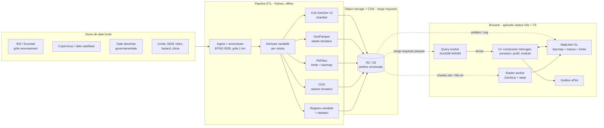

# „Unde locuiesc românii?” — Plan de implementare

> Aplicație web interactivă, integral în browser, pentru explorarea distribuției populației României
> în raport cu sute de variabile geografice, climatice, sociale și economice — de la întrebări simple
> („câți români locuiesc la mare?”) până la analize multi-criteriu, profile detaliate pe celulă de 1 km
> și scenarii de fundamentare a reformei administrative.

**Versiune:** 0.1 · **Data:** 2026-07-18 · **Status:** propunere de arhitectură, înaintea integrării datelor INS

Documente detaliate:

| Document | Conținut |
|---|---|
| [docs/plan/01-date-si-surse.md](docs/plan/01-date-si-surse.md) | Grila de referință, modelul semantic (registrul de variabile), catalogul complet de surse, operaționalizarea conceptelor („la mare”, „lângă pădure”…), confidențialitate |
| [docs/plan/02-pipeline-etl.md](docs/plan/02-pipeline-etl.md) | Pipeline-ul de procesare (Python, offline): armonizare, derivare, export GeoZarr / GeoParquet / PMTiles / COG, QA, publicare versionată |
| [docs/plan/03-frontend-arhitectura.md](docs/plan/03-frontend-arhitectura.md) | Arhitectura aplicației Vite + TypeScript: MapLibre, web workers, DuckDB-WASM, Zarrita.js, uPlot, randarea grilei, UI/UX, accesibilitate, performanță |
| [docs/plan/04-motor-interogare.md](docs/plan/04-motor-interogare.md) | Modelul de constrângeri (AST), compilarea la SQL, agregări, statistici ponderate cu populația, consistență și incertitudine |
| [docs/plan/05-module-analitice.md](docs/plan/05-module-analitice.md) | Preseturile de întrebări, profilul „cetățeanului virtual” pe pixel, modulul de reformă administrativă, modulul de vulnerabilitate, dimensiunea temporală, export/partajare |

---

## 1. Viziune și obiective

**Întrebarea centrală:** *Unde locuiesc românii?* — descompusă în orice combinație de criterii:
formă de relief, altitudine, climă (prezentă și proiectată), distanță față de mare / pădure / apă /
frontieră, mediu urban/rural, acces la servicii, expunere la hazarde, nivel de trai, istorie.

**Obiective:**

1. **Explorare accesibilă** — un nespecialist primește răspuns la o întrebare de tip
   „câți români locuiesc la munte?” în sub 5 secunde, cu hartă, cifră și grafic.
2. **Analiză multi-criteriu** — un analist combină zeci de constrângeri logice
   (ex.: *femei, altitudine 200–500 m, precipitații < 600 mm/an, temperatura medie ~12 °C*)
   și obține populația care le satisface, distribuții și comparații.
3. **Profil „foundation” pe celulă** — fiecare celulă de 1 km are un vector de sute de variabile
   (demografie, relief, sol, climă prezent + viitor, ocuparea terenului, indici satelitari,
   acces la servicii, hazarde, istorie), consultabil ca „fișă de identitate” a locului.
4. **Instrument de decizie** — module dedicate pentru reforma administrativă (scenarii de
   reorganizare a UAT-urilor, cu indicatori obiectivi) și pentru vulnerabilitate
   (populație expusă la inundații, alunecări, cutremure, corelată cu vulnerabilitatea socială).
5. **Transparență totală** — fiecare cifră are sursă oficială, metodologie vizibilă,
   an de referință și note de incertitudine; orice analiză e reproductibilă și partajabilă prin URL.

**Non-obiective (deocamdată):** date la nivel de individ (lucrăm doar cu agregate),
editare colaborativă de date, backend cu stare (aplicația este 100% statică).

## 2. Public țintă și moduri de utilizare

| Persona | Nevoie | Mod de utilizare |
|---|---|---|
| Cetățean curios / presă | răspunsuri rapide, vizuale | **Mod ghidat**: întrebări predefinite, limbaj simplu, glosar |
| Analist / cercetător / student | interogări complexe, export | **Mod expert**: constructor de interogări, profil pixel, comparații, export CSV/GeoJSON |
| Decident / administrație | fundamentare decizii | **Module**: scenarii reformă administrativă, rapoarte de vulnerabilitate, fișe UAT imprimabile |
| ONG / protecție civilă | populație expusă | Modul vulnerabilitate: expunere × vulnerabilitate socială, ierarhizări |

Cele două moduri (ghidat/expert) folosesc același motor; modul ghidat este doar o suprafață
simplificată peste preseturi parametrizabile.

## 3. Principii de proiectare

1. **Cloud-native, fără backend.** Toate datele sunt fișiere statice în formate cloud-native
   (GeoZarr, GeoParquet, PMTiles, COG) servite cu HTTP range requests dintr-un object storage + CDN.
   Toată logica rulează în browser. Costuri de operare aproape zero, scalare implicită, arhivabilitate.
2. **Grila de 1 km este unitatea atomică.** Orice sursă de date (vector, raster, tabel) este
   redusă în pipeline la valori per celulă. Interogarea în browser devine astfel o simplă
   filtrare/agregare pe o tabelă lată — rapidă și predictibilă.
3. **Un singur adevăr semantic.** Un *registru de variabile* (YAML → JSON) descrie fiecare
   variabilă: etichetă, unitate, sursă, licență, an, metodologie, mod de agregare. Registrul
   generează UI-ul, documentația și validările — nimic hard-codat.
4. **Cifrele vin dintr-un singur motor.** DuckDB-WASM este sursa canonică pentru orice număr
   afișat; harta și graficele se derivă din același rezultat (bitset de celule), eliminând
   riscul de inconsistență între hartă și cifre.
5. **Progresiv și tolerant.** Aplicația pornește ușor (hartă + preseturi), încarcă leneș
   componentele grele (DuckDB-WASM ~streaming la prima interogare), cache-uiește agresiv
   (OPFS/IndexedDB) și funcționează rezonabil pe 4G și pe laptopuri modeste.
6. **Onest cu incertitudinea.** Praguri de confidențialitate statistică respectate, note MAUP,
   ecuson cu anul datelor pe fiecare strat, metodologie la un click distanță.

## 4. Arhitectura de ansamblu



Fluxul unei interogări: utilizatorul construiește constrângeri → AST-ul e compilat la SQL →
DuckDB-WASM filtrează tabelele GeoParquet (citind prin range requests doar coloanele necesare) →
rezultatul (agregate + lista `cell_id`) revine ca Arrow → UI afișează KPI + grafice, iar
raster-workerul pictează bitset-ul de celule pe hartă. Detalii în
[04-motor-interogare.md](docs/plan/04-motor-interogare.md).

## 5. Stack tehnologic

| Strat | Tehnologie | Rol / motivare |
|---|---|---|
| Build | **Vite + TypeScript** (strict) | cerință; DX excelent, code-splitting pentru workeri și WASM |
| UI | **React 19 + Zustand** | ecosistem matur pentru UI complex; Zustand pentru stare serializabilă în URL. (Alternativă acceptabilă: Svelte 5 — decizie deschisă §9) |
| Hartă | **MapLibre GL JS v5** + protocol **pmtiles** + **@geomatico/maplibre-cog-protocol** | cerință; bazmap self-hosted, straturi COG direct |
| Interogare | **@duckdb/duckdb-wasm** (+ extensia `spatial` la nevoie) | SQL peste GeoParquet remote, rezultate Arrow, încărcat leneș |
| Cub raster | **Zarrita.js** (Zarr v3, sharding) | citire chunks GeoZarr pentru straturi continue, profile și serii temporale |
| Grafice | **uPlot** | cerință; cel mai rapid pentru serii temporale și histograme |
| Workers | **Comlink** | RPC tipizat main-thread ↔ query-worker / raster-worker |
| Proiecții | **proj4js** (doar EPSG:3035 ↔ 4326/3857, precompilat) | interacțiune hartă↔grilă pur matematică, fără tile-uri de interogare |
| Pipeline | **Python 3.12 (uv)**: xarray, rioxarray, dask, zarr v3, GDAL, exactextract, geopandas, duckdb, WhiteboxTools, rio-cogeo, tippecanoe/planetiler; orchestrare cu **just** | detalii în [02-pipeline-etl.md](docs/plan/02-pipeline-etl.md) |
| Găzduire | **Cloudflare Pages** (aplicația) + **R2** (datele) | range requests + CORS + CDN, egress gratuit; alternativă: orice S3 compatibil |
| CI/CD | GitHub Actions | build app, teste, validare date, publicare versionată |

## 6. Structura repo

```
unde-locuiesc-romanii/
├── PLAN.md                     # acest document
├── docs/
│   ├── plan/                   # documentele de proiectare (01–05)
│   └── metodologie/            # fișe metodologice publicate și în aplicație
├── catalog/                    # SURSA DE ADEVĂR semantică
│   ├── sources.yaml            # surse: URL, licență, an, mod de acces
│   └── variables/*.yaml        # câte un fișier per grup de variabile
├── pipeline/                   # ETL Python (uv + just)
│   ├── justfile
│   └── src/ulr_pipeline/...
├── app/                        # frontend Vite + TS
│   ├── index.html
│   └── src/...
├── data/                       # scratch local, gitignored (brut + intermediar)
└── .github/workflows/
```

## 7. Roadmap pe faze

Estimările presupun 1 dezvoltator full-time cu experiență geo; cu 2 oameni fazele F1–F2 și F3–F4 se pot paraleliza.

| Faza | Durată | Conținut | Criterii de acceptanță |
|---|---|---|---|
| **F0 — Fundații** | 2 săpt. | Repo, CI, schelet Vite+TS+React, bazmap România PMTiles self-hosted (Planetiler din extract OSM), stil cu diacritice, hillshade, layout UI de bază, registru de variabile v0 (schemă + 5 variabile mock) | aplicația se încarcă < 2,5 s pe 4G; harta funcționează pe mobil și desktop |
| **F1 — Date nucleu** | 3–4 săpt. | Pipeline pentru: grila de populație INS/Eurostat 2021 (toate atributele disponibile), DEM + derivate (altitudine, pantă, expoziție, geomorfoni), unități de relief, limite administrative + SIRUTA, DEGURBA/GHS-SMOD, distanțe (mare, frontieră, pădure, râu, lac), CLC/WorldCover. Export GeoParquet + GeoZarr + PMTiles limite. | tabela `core` + `env` validate (pandera + verificări de total: suma populației = totalul INS); cub Zarr citibil cu Zarrita din browser |
| **F2 — Motor + MVP public (alfa)** | 3 săpt. | DuckDB-WASM în worker, compilator AST→SQL, cele **6 întrebări-preset** funcționale cu parametri ajustabili, mască pe hartă, KPI (persoane, % din România, nr. celule), histogramă uPlot, permalink | fiecare preset răspunde < 3 s la prima rulare, < 0,5 s la următoarele; cifrele identice cu verificarea offline din pipeline (test golden) |
| **F3 — Profil + comparații** | 3 săpt. | Click pe celulă → profil complet (toate variabilele, percentile față de țară/județ), fișă UAT, selecție de zonă (poligon/UAT) → statistici agregate ponderate cu populația, comparație 2+ zone side-by-side, piramida vârstelor, export CSV/GeoJSON/PNG | profil < 1 s; comparație a 3 județe cu 20 de variabile fără blocarea UI |
| **F4 — Climă și timp** | 2–3 săpt. | Normale climatice (1961–90 … 1991–2020), proiecții CMIP6/EURO-CORDEX (2041–70, 2071–2100, scenarii SSP), indici derivați, serii temporale în cub (chunking pe timp), time-slider + grafice uPlot sincronizate cu harta, serii pre-agregate per UAT | întrebarea-exemplu (femei, 200–500 m, <600 mm, ~12 °C) funcționează, inclusiv cu clima proiectată 2071–2100 |
| **F5 — Vulnerabilitate** | 3 săpt. | Straturi hazard per celulă (inundații 0,1%/1%/10%, susceptibilitate alunecări, zonare seismică), populație expusă, index de vulnerabilitate socială, modul dedicat cu ierarhizări pe UAT și rapoarte | „câți oameni locuiesc în zone inundabile la scenariul 1%?” cu defalcare pe vârstă/județ |
| **F6 — Reformă administrativă** | 4 săpt. | Constructor de scenarii de comasare UAT (selecție pe hartă, indicatori pentru unitatea rezultată: populație, suprafață, densitate, timpi de acces ponderați, tendință demografică, servicii), praguri configurabile, comparare și export scenarii (JSON + raport imprimabil) | un scenariu de comasare a 3 comune produce fișă completă < 5 s |
| **F7 — Catalog extins + similaritate** | continuu | Servicii (educație, sănătate, transport — timpi de acces), economie, sărăcie/marginalizare, indici satelitari (NDVI, LST, lumini nocturne, impermeabilizare), istorie (recensăminte 1930–2021, hărți istorice), embedding per celulă (PCA 32-dim) → căutare de similaritate și tipologii precalculate | „arată-mi locurile care seamănă cu această celulă” < 1 s |
| **F8 — Lansare v1.0** | 2–3 săpt. | Audit accesibilitate WCAG 2.2 AA, audit performanță, mod ghidat finisat + glosar, pagini de metodologie complete, story-mode introductiv (opțional), SEO/OG pentru permalink-uri | Lighthouse ≥ 90; testare cu utilizatori nespecialiști (5 sesiuni) fără blocaje majore |

**MVP = sfârșitul F2**: cele 6 întrebări pe date reale + constructor de filtre pe ~15 variabile
+ hartă + KPI + histogramă + permalink. Publicabil ca alfa pentru feedback.

## 8. Riscuri și mitigări

| Risc | Impact | Mitigare |
|---|---|---|
| Formatul/licența datelor INS pe grilă întârzie sau diferă de așteptări | blochează F1 | grila Eurostat Census 2021 (1 km, publică) ca fundație; GHS-POP ca strat de rezervă; pipeline-ul acceptă orice sursă per-celulă |
| Confidențialitate statistică (celule cu populație mică) | cifre distorsionate la filtre înguste | propagarea flag-urilor SDC, afișare „sub pragul de confidențialitate”, agregare minimă impusă în UI (detalii în 01-date) |
| Dimensiunea DuckDB-WASM (~5–10 MB gz) la primul load | UX slab pe conexiuni lente | încărcare leneșă la prima interogare, cu progres vizibil; preseturile simple pot răspunde din statistici precalculate până se încarcă |
| Memorie browser la seriile temporale mari | crash pe device-uri slabe | chunking Zarr orientat pe acces, serii pre-agregate per UAT, streaming per-chunk cu progres, bugete de memorie testate în CI |
| Interpretare greșită (MAUP, ecologic fallacy) | pierdere de credibilitate | note metodologice inline, praguri, formulări prudente în modul ghidat, pagina „cum citim aceste hărți” |
| Amestec de licențe (ODbL din OSM vs. CC-BY) | obligații share-alike neintenționate | coloanele derivate din OSM marcate în registru; preferăm surse UE/guvernamentale pentru variabilele de bază (detalii în 01-date §6) |
| Scope creep (sute de variabile posibile) | nu se mai lansează | registrul de variabile e prioritizat pe faze; orice variabilă nouă = un YAML + un modul de pipeline, nu cod nou în aplicație |

## 9. Decizii deschise (de închis la pasul următor, odată cu datele)

1. **Datele INS**: format exact al grilei (atribute disponibile pe celulă? doar total sau și sex/vârstă?),
   licență, praguri de confidențialitate. Determină cât putem defalca în interogări.
2. **React vs. Svelte** — planul presupune React; schimbarea e ieftină doar înainte de F0.
3. **Găzduire** — Cloudflare Pages + R2 propus; de confirmat buget/preferințe (sau infrastructura geo-spatial.org).
4. **Bilingv RO/EN** de la început sau doar RO cu i18n pregătit? (Planul pregătește i18n, livrează RO.)
5. **Nume și domeniu** — „Unde locuiesc românii?” ca titlu; de decis brand/domeniu.
6. **Accesul la date cu licențe incerte** (APIA/LPIS, ANCOM, unele hărți de hazard) — negociem sau folosim proxy-uri publice.
